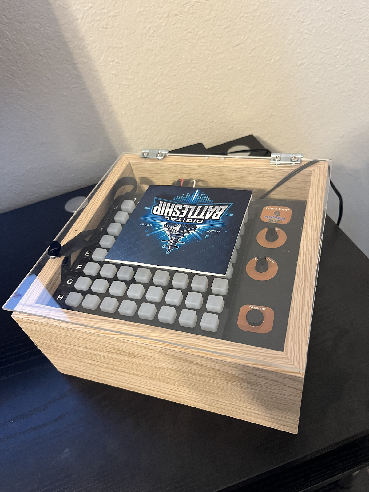
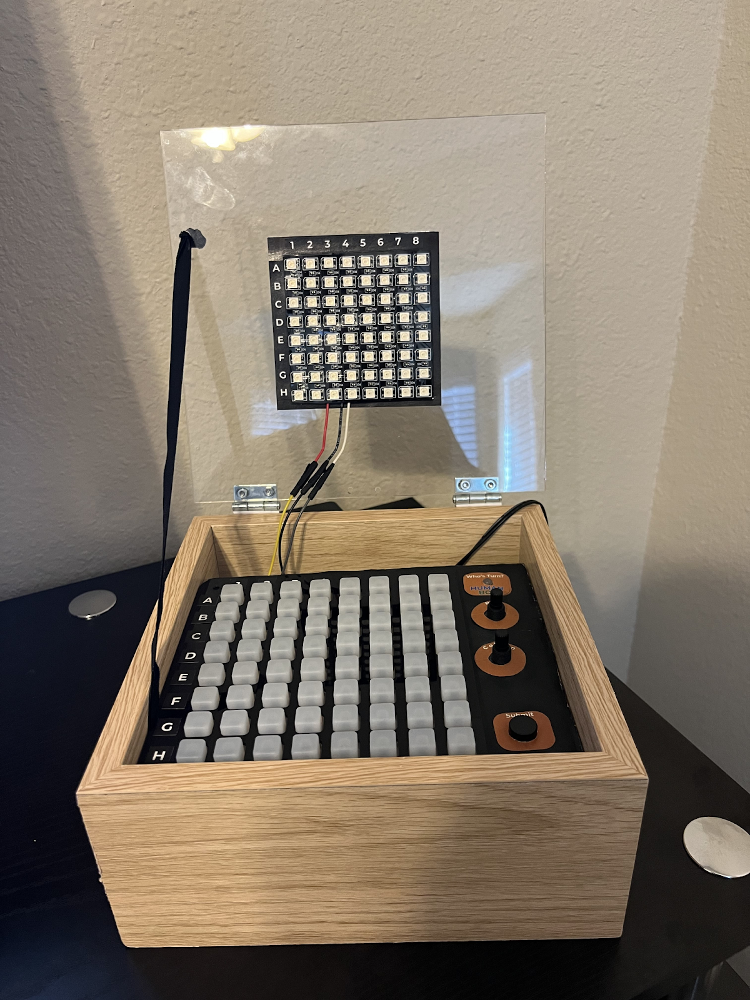
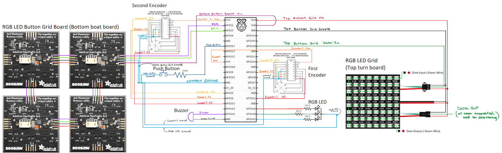

# Battleship Game with Raspberry Pi

A modern take on the classic Battleship game, implemented as a standalone system using Raspberry Pi. This project transforms traditional Battleship into a plug-and-play gaming experience with physical controls and feedback.

## Project Overview
This Battleship implementation is a standalone single-player game system. Once plugged in, the game automatically starts, allowing players to immediately challenge the AI opponent using physical buttons. The game provides feedback through LED indicators and a buzzer system, creating an engaging arcade-like experience.

## Key Features

### Game Modes
- **Single Player vs AI**: Challenge our strategic AI opponent in an engaging battle of wits

### Hardware Integration
- **Physical Controls**: Custom button interface for gameplay actions
- **Visual Feedback**: LED indicators for hits and misses
- **Audio Feedback**: Buzzer system for game events
- **Plug-and-Play**: System auto-starts when powered on

### Software Features
- Fully automated startup system
- Intelligent AI opponent with strategic ship placement
- Robust game logic with ship placement validation
- Real-time game state tracking

## Technical Implementation

### AI Implementation
The AI opponent features two main components:
- Strategic ship placement algorithm (`bot_ship_placement.py`)
- Intelligent targeting system for making shots (`battleship.py`)

### Hardware Components
- Raspberry Pi
- Push buttons for player input
- LED indicators
- Buzzer for sound effects
- Custom circuit design for component integration
- Power supply connection

### Software Architecture
The project is structured into several key components:
- Main game logic and AI targeting system (`battleship.py`)
- AI ship placement logic (`bot_ship_placement.py`)
- Ship placement management (`ship_placement.py`)
- Hardware testing utilities (`testBuzzer.py`)
- Automated startup configuration (crontab)

## Demonstration
Watch our project demonstration:
+ [View Project Demo Video](https://drive.google.com/file/d/1-co0soc9OvND7N32Br5NL9oIyR7P5KUJ/view?usp=sharing)

The video demonstrates:
- Hardware setup and connections
- Plug-and-play functionality
- Single-player mode against AI
- Physical button interactions
- LED and buzzer feedback

### Gameplay Preview
Here are demonstrations of each game stage:

1. **Game Setup & Ship Placement**
   [View Setup & Placement Video](https://drive.google.com/file/d/1TjxsinkgjliyGsgxd1W3BIkSpbh16Aq1/view?usp=drive_link)

2. **Battle Phase**
   [Player and Bot Turns](https://drive.google.com/file/d/1fAdCpifUHHTuGwrnZZctQl-5V5AIBvoV/view?usp=drive_link)
   [Human Sinks Bot Ship](https://drive.google.com/file/d/1LayeKJ-q8lvYjMCMzwxlH0546B0FA2uk/view?usp=drive_link)
   [Bot Sinks Human Ship](https://drive.google.com/file/d/1GKTbnw3NR8TWpZJM7S87t6M9nBny3kOr/view?usp=drive_link)
  

4. **Victory Sequence**
   [Human Victory](https://drive.google.com/file/d/1V6h9-iemIWQ6wpYh_XopoVqEt1QE1Srv/view?usp=drive_link)
   [Human Loss](https://drive.google.com/file/d/1XitjqltrKR5nu6IqRnZYI8miYwTDal1i/view?usp=drive_link)

## Circuit Design

## Development Process
This project was developed as part of a course assignment, combining software development with physical computing concepts. The implementation required careful consideration of:
- Physical interface design
- Hardware-software integration
- Game logic implementation
- AI strategy development
- Automated startup system

## Technologies Used
- Python
- Raspberry Pi GPIO
- Electronic Components (LEDs, Buttons, Buzzer)
- Circuit Design
- Linux Crontab for auto-start

## Team
This project was developed in collaboration with [Partner's name if they want to be credited].

## Project Status
This project was completed as an academic assignment and successfully demonstrated the integration of software and hardware components in an interactive gaming application. 
